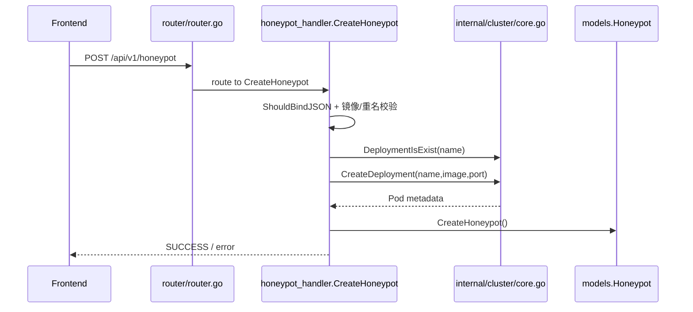
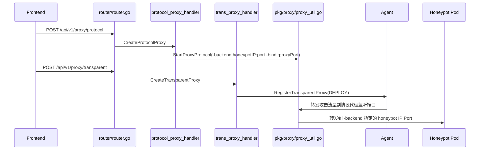
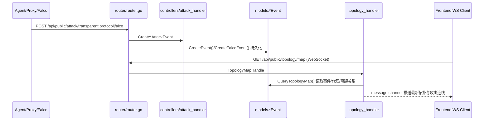

# Core Flow Source Navigation（Refined）

仅聚焦以下 3 条核心链路：
1. 预部署蜜罐（K8s 联动）
2. 攻击进行中流量代理与注入
3. 攻击后日志持久化与 WebSocket 推送

---

## 1) Sequence Navigation（按调用顺序）

### Flow A: 预部署蜜罐（K8s integration）



关键代码入口：
- `router/router.go` → `private.POST("/honeypot", honeypot_handler.CreateHoneypot)`
- `controllers/honeypot_handler/honeypot.go` → `CreateHoneypot`
- `internal/cluster/core.go` → `CreateDeployment`, `DeploymentIsExist`

### 核心函数与代码解析

**CreateHoneypot（控制层入口，类似 Spring 的 @RestController）**

```go
// 统一封装 Gin Context，便于返回标准响应结构
appG := app.Gin{C: c}
// 从 JSON 请求体绑定蜜罐创建参数
_ = c.ShouldBindJSON(&honeypot)
// 根据镜像地址读取镜像配置（端口/协议类型）
s, _ := image.GetImageByAddress(honeypot.ImageAddress)
// 校验业务侧是否已有同名蜜罐记录
_ = honeypot.GetHoneypotByName(honeypot.HoneypotName)
// 校验 K8s 中是否已存在同名 Deployment
flag, _ := cluster.DeploymentIsExist(honeypot.HoneypotName)
// 调用底层 K8s 创建 Deployment 并返回 Pod
pod, _ := cluster.CreateDeployment(honeypot.HoneypotName, s.ImageAddress, s.ImagePort)
// 将 Pod 名回填到业务模型
honeypot.PodName = pod.Name
// 将镜像端口回填为服务端口
honeypot.ServerPort = s.ImagePort
// 将镜像协议类型同步到蜜罐模型
honeypot.ProtocolType = s.ProtocolType
// 标记蜜罐为运行中状态
honeypot.Status = comm.RUNNING
// 最终写入数据库，完成控制面创建
_ = honeypot.CreateHoneypot()
```

**CreateDeployment（K8s 资源构造 + client-go 创建）**

```go
// 构造 Deployment 对象并填充基础元信息
deployment := &appsV1.Deployment{
	// 指定 Deployment 名称用于后续查询与删除
	ObjectMeta: metaV1.ObjectMeta{Name: podName},
	// 设置副本数、选择器与 Pod 模板
	Spec: appsV1.DeploymentSpec{
		// 单副本部署满足蜜罐最小资源需求
		Replicas: int32Ptr(1),
		// selector 与 pod 标签保持一致以便关联
		Selector: &metaV1.LabelSelector{MatchLabels: map[string]string{"app": "ehoney"}},
		// pod 模板定义容器镜像与端口
		Template: apiV1.PodTemplateSpec{
			// 统一打上 app 标签用于观测与筛选
			ObjectMeta: metaV1.ObjectMeta{Labels: map[string]string{"app": "ehoney"}},
			// 指定容器镜像地址与暴露端口
			Spec: apiV1.PodSpec{Containers: []apiV1.Container{{Name: podName, Image: imageAddress, Ports: []apiV1.ContainerPort{{Name: podName, Protocol: apiV1.ProtocolTCP, ContainerPort: containerPort}}}}},
		},
	},
}
// 调用 client-go 创建 Deployment 资源
_, _ = deploymentsClient.Create(context.TODO(), deployment, metaV1.CreateOptions{})
// 等待 Pod Ready，避免后续访问失败
_ = waitForPodStartBuild(apiV1.NamespaceDefault, podName, time.Minute)
```

### Flow B: 流量代理与注入（In-progress traffic proxying/hijacking）



关键代码入口：
- `controllers/protocol_proxy_handler/protocol_proxy.go` → `CreateProtocolProxy`
- `pkg/proxy/proxy_util.go` → `StartProxyProtocol`
- `controllers/trans_proxy_handler/trans_proxy.go` → `CreateTransparentProxy`

### 核心函数与代码解析

**StartProxyProtocol（独立拉起协议代理进程）**

```go
// 先检查代理端口是否可用，避免占用导致启动失败
if !portCheck(protocolProxy.ProxyPort) {
	// 标记为失败状态，交由上层决定是否回滚
	protocolProxy.Status = comm.FAILED
}
// 拼装代理启动命令，将攻击流量转发到蜜罐后端
startCmd := fmt.Sprintf("%s -backend %s:%d -bind :%d -ppid :%s",
	protocolProxy.ProtocolPath,
	protocolProxy.HoneypotIp,
	protocolProxy.HoneypotPort,
	protocolProxy.ProxyPort,
	protocolProxy.ProtocolProxyId,
)
// 统一使用 bash 模式启动可执行代理程序
startMode := "bash"
// 校验协议代理二进制是否存在
_ = util.FileExists(protocolProxy.ProtocolPath)
// 通过 StartProcess 拉起独立进程并返回 PID
startedProxyPid, _ := util.StartProcess(startCmd, startMode, "protocol-proxy-"+protocolProxy.ProtocolProxyName)
// 将 PID 返回给上层持久化记录
_ = startedProxyPid.Id
```

### Flow C: 事件后日志持久化 + WebSocket push



关键代码入口：
- `controllers/attack_handler/attack.go` → `CreateTransparentEventEvent`, `CreateProtocolAttackEvent`, `CreateFalcoAttackEvent`
- `models/transparent_attck_event.go` / `models/protocol_attack_event.go` / `models/falco.go`
- `controllers/topology_handler/topology_handler.go` → `TopologyMapHandle`, `refreshTopology`, `QueryTopologyMap`

### 核心函数与代码解析

**CreateProtocolAttackEvent（控制层入库入口，类比 JPA/MyBatis）**

```go
// 从上报请求体绑定攻击事件字段
_ = c.ShouldBind(&attackEvent)
// 过滤本机与控制面自身 IP，避免自测噪声入库
if attackEvent.AttackIp == "127.0.0.1" || attackEvent.AttackIp == configs.GetSetting().Server.AppHost {
	// 直接返回，避免产生无效攻击事件
	return
}
// 清洗上报的代理 ID 格式，便于后续关联
attackEvent.ProtocolProxyId = strings.ReplaceAll(attackEvent.ProtocolProxyId, ":", "")
// 校验 IP 字符串合法性，不合法则降级标记
if net.ParseIP(attackEvent.AttackIp) == nil {
	// 兜底设置攻击来源为 Unknown，避免解析异常
	attackEvent.AttackIp = "Unknown"
}
// 调用模型方法触发 GORM 持久化
_ = attackEvent.CreateEvent()
```

**ProtocolEvent.CreateEvent（GORM 写库主干）**

```go
// 生成全局唯一事件 ID
event.ProtocolEventId = util.GenerateId()
// 记录入库时间用于统计与检索
event.CreateTime = util.GetCurrentIntTime()
// 通过 GORM 将事件写入 protocol_events 表
_ = db.Create(event)
```

**topology()（Channel 驱动的 WS 广播主干）**

```go
// 维护在线 WS 客户端集合（key=连接名）
clients := make(map[string]Client)
// 循环监听消息/订阅/取消订阅三类事件
for {
	// 通过 select 同步处理不同通道的数据
	select {
	// 收到拓扑更新消息则广播给所有客户端
	case msg := <-message:
		// 遍历客户端并写入 WebSocket 文本消息
		for _, client := range clients {
			// 将结构化消息序列化为 JSON
			data, _ := json.Marshal(msg)
			// 写入 WS 连接实现实时推送
			_ = client.Conn.WriteMessage(websocket.TextMessage, data)
		}
	}
}
```

---

## 2) Model Navigation（按数据对象/结构体）

| 模型 / 结构体 | 所在文件 | 在核心流中的角色 | 主要写入点 | 主要读取/消费点 |
|---|---|---|---|---|
| `models.Honeypot` | `models/honeypot.go` | 蜜罐控制面记录（Pod名、IP、协议、状态） | `CreateHoneypot` | 协议代理创建、状态刷新、拓扑查询 |
| `appsV1.Deployment` / `apiV1.Pod` | `internal/cluster/core.go` | K8s 资源定义与返回对象 | `CreateDeployment` | `GetPodDetailInfo`、删除与状态同步 |
| `models.ProtocolProxy` | `models/protocol_proxy.go` | 协议代理进程映射（监听端口、后端蜜罐、PID） | `CreateProtocolProxy` | 透明代理关联、拓扑 RELAY 节点/连线 |
| `models.TransparentProxy` | `models/transparent_proxy.go` | Agent 转发规则（入口端口 -> 协议代理目标） | `CreateTransparentProxy` | Agent 下发、连通性测试、上下线 |
| `models.TransparentEvent` | `models/transparent_attck_event.go` | 透明代理阶段攻击日志 | `CreateTransparentEventEvent` | 拓扑 `attack -> EDGE` 红线、攻击统计 |
| `models.ProtocolEvent` | `models/protocol_attack_event.go` | 协议代理阶段攻击日志 | `CreateProtocolAttackEvent` | 拓扑 `attack/EDGE -> RELAY -> POD` 红线 |
| `models.FalcoAttackEvent` | `models/falco.go` | 蜜罐内部运行时告警日志 | `CreateFalcoAttackEvent` | 事件检索、详情查看、拓扑侧风险感知 |
| `comm.TopologyNode` / `comm.TopologyLine` | `controllers/comm` | WebSocket 推送的数据视图对象 | `QueryTopologyMap` 组装 | `TopologyMapHandle` 推送到前端 |

---

## 3) Frontend Page → Backend Code Mapping（仅核心流相关）

> 前端页面路由在 `router/router.go` 中由 `r.GET("/decept-defense/...", index.html)` 承载，接口调用由前端 JS 发起到 `/api/...`。

| 前端页面路由 | 核心流 | 关键后端 API | 路由注册 | Controller / Core 代码 |
|---|---|---|---|---|
| `/decept-defense/honeypots/*id` | 预部署蜜罐 | `POST /api/v1/honeypot` | `private.POST("/honeypot", ...)` | `honeypot_handler.CreateHoneypot` → `cluster.CreateDeployment` |
| `/decept-defense/proxy-manage/*id` | 流量代理与注入 | `POST /api/v1/proxy/protocol` | `private.POST("/proxy/protocol", ...)` | `protocol_proxy_handler.CreateProtocolProxy` → `proxy.StartProxyProtocol` |
| `/decept-defense/proxy-manage/*id` | 流量代理与注入 | `POST /api/v1/proxy/transparent` | `private.POST("/proxy/transparent", ...)` | `trans_proxy_handler.CreateTransparentProxy` → `agent_client.RegisterTransparentProxy` |
| `/decept-defense/threaten-perception/*id` / `/decept-defense/datav` | 攻击后日志与联动展示 | `POST /api/public/attack/protocol` / `transparent` / `falco` | `public.POST("/attack/...", ...)` | `attack_handler.Create*AttackEvent` → `models.*Event.Create...` |
| `/decept-defense/threaten-perception/*id` / `/decept-defense/datav` | 攻击后 WebSocket 实时推送 | `GET /api/public/topology/map` (WS) | `public.GET("/topology/map", ...)` | `topology_handler.TopologyMapHandle` + `refreshTopology/QueryTopologyMap` |
