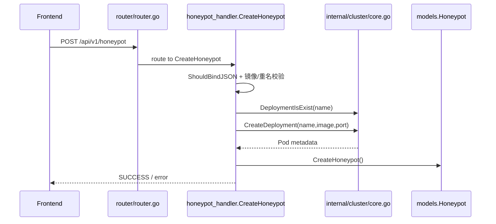
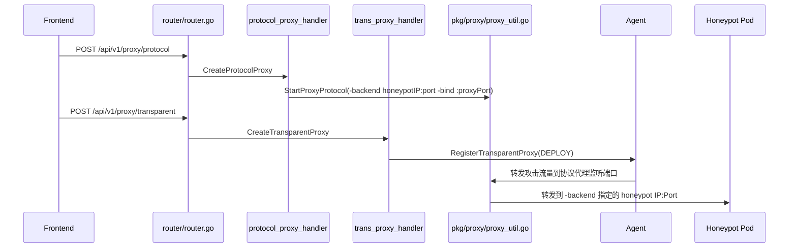
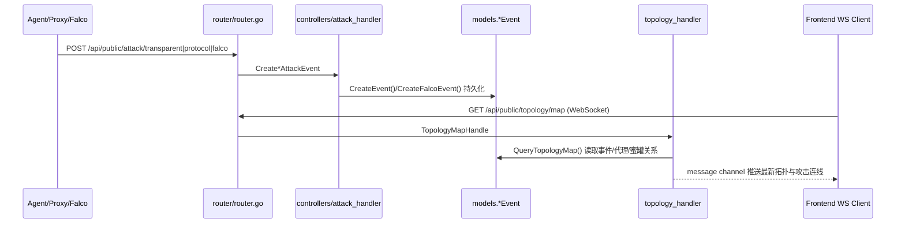

# Core Flow Source Navigation（Refined）

仅聚焦以下 3 条核心链路：
1. 预部署蜜罐（K8s 联动）
2. 攻击进行中流量代理与注入
3. 攻击后日志持久化与 WebSocket 推送

---

## 1) Sequence Navigation（按调用顺序）

### Flow A: 预部署蜜罐（K8s integration）

关键代码入口：
- `router/router.go` → `private.POST("/honeypot", honeypot_handler.CreateHoneypot)`
- `controllers/honeypot_handler/honeypot.go` → `CreateHoneypot`
- `internal/cluster/core.go` → `CreateDeployment`, `DeploymentIsExist`

### Flow B: 流量代理与注入（In-progress traffic proxying/hijacking）

关键代码入口：
- `controllers/protocol_proxy_handler/protocol_proxy.go` → `CreateProtocolProxy`
- `pkg/proxy/proxy_util.go` → `StartProxyProtocol`
- `controllers/trans_proxy_handler/trans_proxy.go` → `CreateTransparentProxy`

### Flow C: 事件后日志持久化 + WebSocket push

关键代码入口：
- `controllers/attack_handler/attack.go` → `CreateTransparentEventEvent`, `CreateProtocolAttackEvent`, `CreateFalcoAttackEvent`
- `models/transparent_attck_event.go` / `models/protocol_attack_event.go` / `models/falco.go`
- `controllers/topology_handler/topology_handler.go` → `TopologyMapHandle`, `refreshTopology`, `QueryTopologyMap`

---

## 2) Model Navigation（按数据对象/结构体）

| 模型 / 结构体 | 所在文件 | 在核心流中的角色 | 主要写入点 | 主要读取/消费点 |
|---|---|---|---|---|
| `models.Honeypot` | `models/honeypot.go` | 蜜罐控制面记录（Pod名、IP、协议、状态） | `CreateHoneypot` | 协议代理创建、状态刷新、拓扑查询 |
| `appsV1.Deployment` / `apiV1.Pod` | `internal/cluster/core.go` | K8s 资源定义与返回对象 | `CreateDeployment` | `GetPodDetailInfo`、删除与状态同步 |
| `models.ProtocolProxy` | `models/protocol_proxy.go` | 协议代理进程映射（监听端口、后端蜜罐、PID） | `CreateProtocolProxy` | 透明代理关联、拓扑 RELAY 节点/连线 |
| `models.TransparentProxy` | `models/transparent_proxy.go` | Agent 转发规则（入口端口 -> 协议代理目标） | `CreateTransparentProxy` | Agent 下发、连通性测试、上下线 |
| `models.TransparentEvent` | `models/transparent_attck_event.go` | 透明代理阶段攻击日志 | `CreateTransparentEventEvent` | 拓扑 `attack -> EDGE` 红线、攻击统计 |
| `models.ProtocolEvent` | `models/protocol_attack_event.go` | 协议代理阶段攻击日志 | `CreateProtocolAttackEvent` | 拓扑 `attack/EDGE -> RELAY -> POD` 红线 |
| `models.FalcoAttackEvent` | `models/falco.go` | 蜜罐内部运行时告警日志 | `CreateFalcoAttackEvent` | 事件检索、详情查看、拓扑侧风险感知 |
| `comm.TopologyNode` / `comm.TopologyLine` | `controllers/comm` | WebSocket 推送的数据视图对象 | `QueryTopologyMap` 组装 | `TopologyMapHandle` 推送到前端 |

---

## 3) Frontend Page → Backend Code Mapping（仅核心流相关）

> 前端页面路由在 `router/router.go` 中由 `r.GET("/decept-defense/...", index.html)` 承载，接口调用由前端 JS 发起到 `/api/...`。

| 前端页面路由 | 核心流 | 关键后端 API | 路由注册 | Controller / Core 代码 |
|---|---|---|---|---|
| `/decept-defense/honeypots/*id` | 预部署蜜罐 | `POST /api/v1/honeypot` | `private.POST("/honeypot", ...)` | `honeypot_handler.CreateHoneypot` → `cluster.CreateDeployment` |
| `/decept-defense/proxy-manage/*id` | 流量代理与注入 | `POST /api/v1/proxy/protocol` | `private.POST("/proxy/protocol", ...)` | `protocol_proxy_handler.CreateProtocolProxy` → `proxy.StartProxyProtocol` |
| `/decept-defense/proxy-manage/*id` | 流量代理与注入 | `POST /api/v1/proxy/transparent` | `private.POST("/proxy/transparent", ...)` | `trans_proxy_handler.CreateTransparentProxy` → `agent_client.RegisterTransparentProxy` |
| `/decept-defense/threaten-perception/*id` / `/decept-defense/datav` | 攻击后日志与联动展示 | `POST /api/public/attack/protocol` / `transparent` / `falco` | `public.POST("/attack/...", ...)` | `attack_handler.Create*AttackEvent` → `models.*Event.Create...` |
| `/decept-defense/threaten-perception/*id` / `/decept-defense/datav` | 攻击后 WebSocket 实时推送 | `GET /api/public/topology/map` (WS) | `public.GET("/topology/map", ...)` | `topology_handler.TopologyMapHandle` + `refreshTopology/QueryTopologyMap` |

